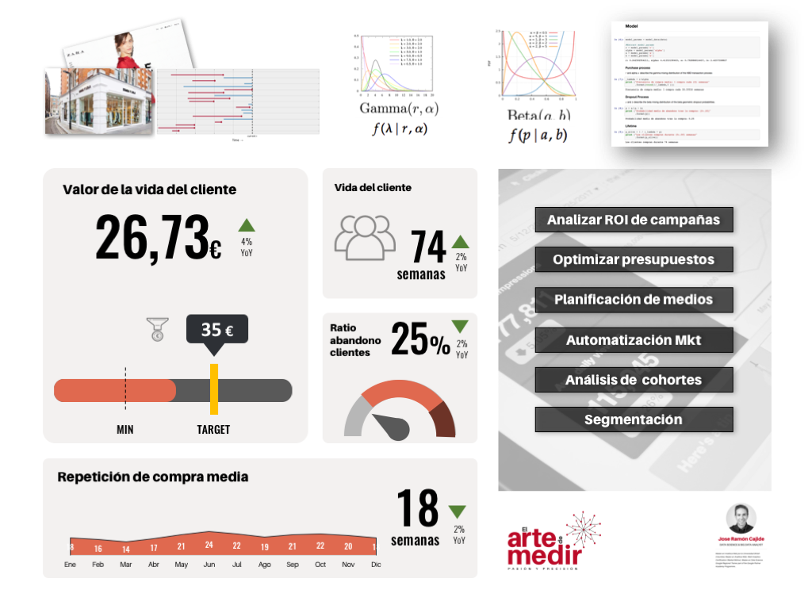

# Predictive Customer lifetime value in no contractual settings (Retail)

Customer lifetime value (CLV) is the top Key Performance Indicator for a retail company. Predicting the future purchasing patterns of their customers and correctly describing customer churn is important to estimate their CLV.

This CLV will help managers to effectively allocate their time and money or determine customer retention.

Predicting customer lifetime and monetary value in a non-contractual business using the BG/NBD ( (Beta Geometric / Negative Binomial Distribution) is the model proposed in [`'Counting Your Customers' the Easy Way: An Alternative to the Pareto/NBD Model`](http://brucehardie.com/papers/018/fader_et_al_mksc_05.pdf) by Peter S. Fader, Bruce G. S. Hardie and Ka Lok Lee.

* Accompanying notebook and slides for Data Konferences Feb. 2018 (Madrid)

[`Jupyter Notebook`](customer_centric_metrics.ipynb)

[`Slides`](DataKonferencesFeb2018.pdf)

[`Slides Mini Data Konferences`](DataKonferencesMay2018.pdf)

